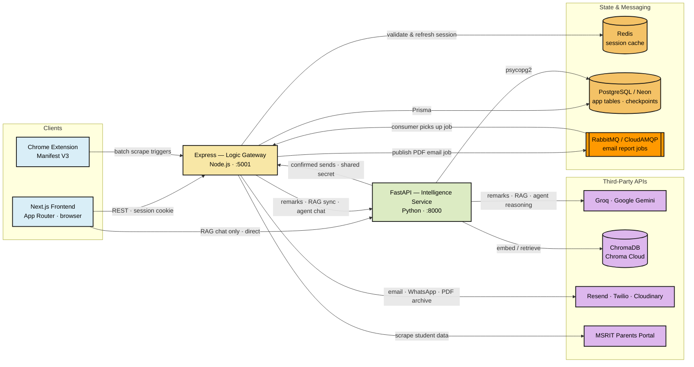
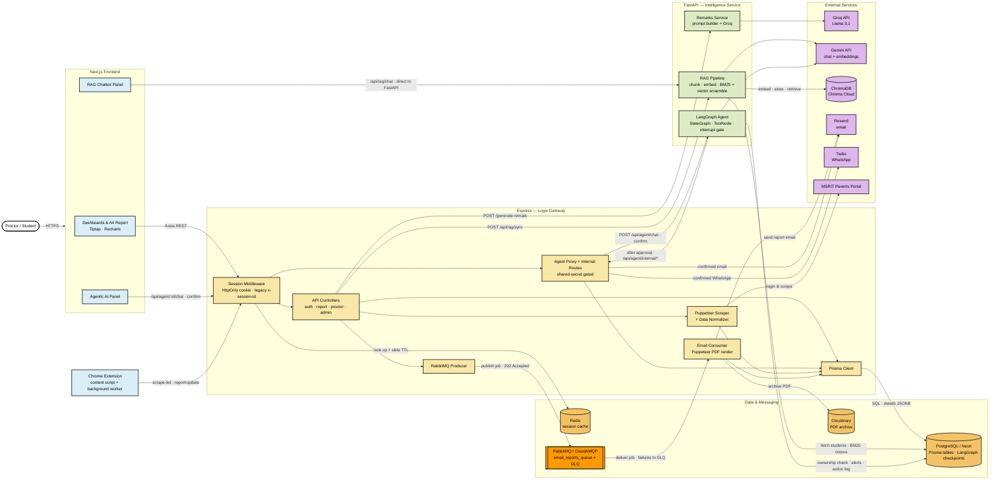
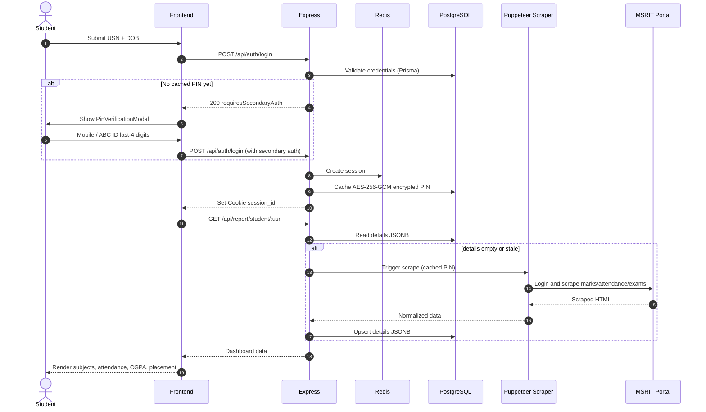
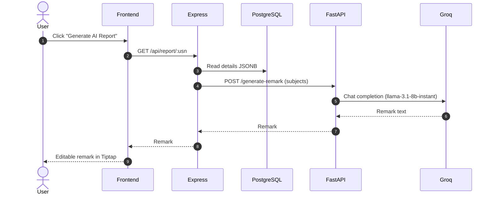
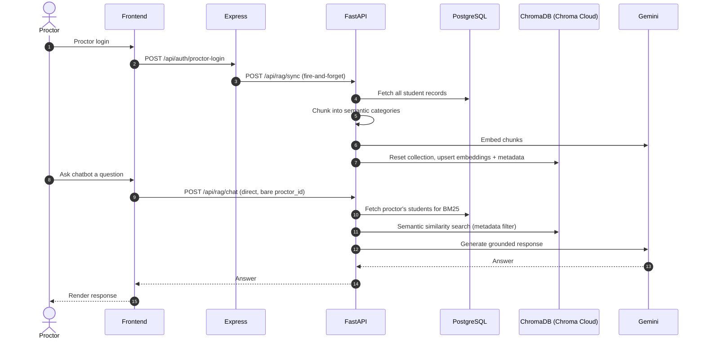
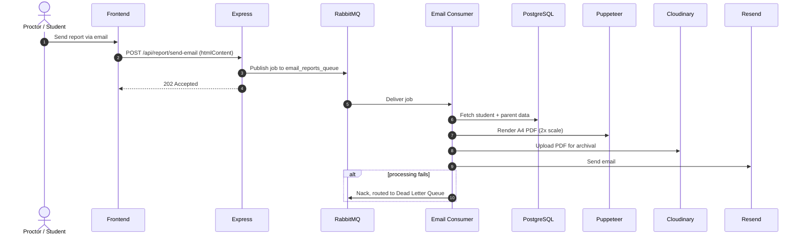
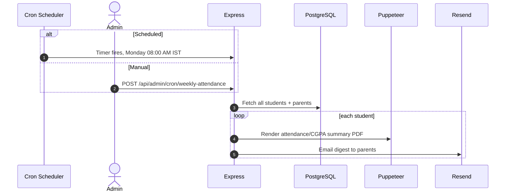
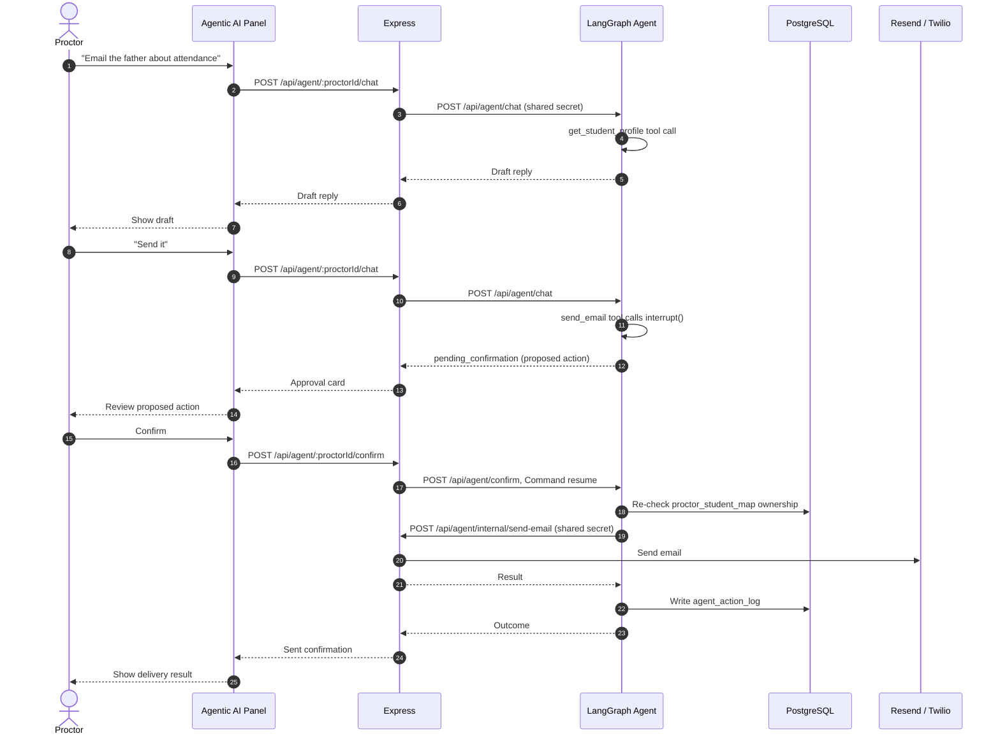
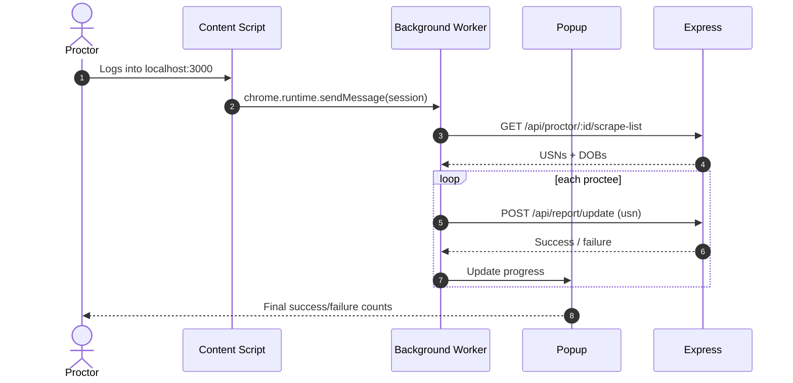

#  &nbsp;          MSR INSIGHT
<br/>


An industry-grade, AI-powered academic reporting platform designed to transform raw student data into professional, insight-driven performance reports. Featuring a multi-tier architecture, RAG-powered chatbot, browser extension for batch scraping, secure session management, and generative AI feedback loops.

## Key Features

- **AI-Powered Insights**: Real-time performance analysis using Groq (Llama 3.1) and AI-generated academic remarks.
- **RAG Chatbot**: Retrieval-Augmented Generation chatbot powered by LangChain, ChromaDB (Chroma Cloud), and Google Gemini, enabling proctors to query student data conversationally.
- **Agentic AI Assistant**: A separate LangGraph-based agent (own routes, DB tables, and UI panel) that proactively flags at-risk students, summarizes weekly priorities, and drafts/sends parent communications -- side-effect actions like email/WhatsApp pause on a real human-in-the-loop confirmation before anything is sent.
- **Interactive Dashboards**: Specialized views for Students (personal progress tracking, placement eligibility/status tracking) and Proctors (administrative management with attendance alerts).
- **Professional A4 Reports**: Pixel-perfect reporting engine with Tiptap rich-text editing and high-fidelity PDF export.
- **Automated Email Delivery**: Asynchronous, RabbitMQ-backed Producer-Consumer queue for fast PDF generation (Puppeteer) and email dispatch (Resend).
- **Weekly Attendance Digest**: Self-scheduled cron (no external cron library) that emails every parent an attendance/CGPA summary each Monday at 08:00 AM IST.
- **Browser Extension**: Chrome extension for one-click batch scraping of all proctee data with real-time progress tracking.
- **Enterprise-Grade Security**: Redis-backed stateless session management with 30-day sliding TTL and case-insensitive identity mapping.
- **Rate-Limited Scraping**: 5-minute cooldown per student to prevent portal overload, with client-side countdown timer.
- **High-Performance Architecture**: Tiered system separation (UI, Business Logic, and Data Processing) for maximum scalability.


## Architecture Overview

The system operates on a **distributed monolith** architecture with four independently runnable components:

1. **Frontend (Next.js)**: Modern, responsive UI built with Next.js 16 App Router, TypeScript, and Tailwind CSS v4.
2. **Logic Gateway (Express)**: Orchestrates business logic, manages PostgreSQL through Prisma ORM, handles session caching in Redis, and runs Puppeteer-based scraping with data normalization into the `details` JSONB shape.
3. **Intelligence Service (FastAPI)**: A high-performance Python service dedicated to AI remark generation (Groq), the RAG chatbot (Gemini + LangChain + ChromaDB), and the Agentic AI chatbot (Gemini + LangGraph).
4. **Browser Extension (Chrome)**: Manifest V3 extension that detects proctor sessions and orchestrates batch scraping of assigned students.

## Component Interaction

Top-level view of the four runnable components and the infrastructure they touch.
**Every arrow points from caller to callee** — none are bidirectional.



Two edges are easy to miss and are deliberate:

- **`Frontend → FastAPI`** exists *only* for the RAG chatbot panel, which calls `/api/rag/chat` directly with a bare `proctor_id`. Everything else — including the Agentic AI panel — goes through Express.
- **`FastAPI → Express`** is the Agentic AI callback: FastAPI never talks to Resend/Twilio itself. After the proctor confirms an action, it calls back into Express's `/api/agent/internal/*` routes behind the shared `AGENT_GATEWAY_SECRET`.

## Architecture Design

Internal breakdown of each component, and the exact path every request takes.



The three FastAPI units are **independent**: RAG and the Agentic AI agent both read from the shared
Postgres instance, and all three share the Gemini/Groq credentials, but never call each other. Groq
serves only remark generation; Gemini serves both the RAG chain and the agent's tool-calling loop, each
through its own client. RAG's vector embeddings live in Chroma Cloud, a separate managed service from
Postgres/Neon.

## Tech Stack


<div align="center">

<!-- <table>
  <tr>
    <th width="45%">Layer</th>
    <th width="45%">Technology</th>
    <th width="35%">Version / Details</th>
  </tr>

  <tr>
    <td><b>Frontend Framework</b></td>
    <td>Next.js (App Router)</td>
    <td>16.x</td>
  </tr>

  <tr>
    <td><b>Frontend Language</b></td>
    <td>TypeScript</td>
    <td>5.x</td>
  </tr>

  <tr>
    <td><b>CSS</b></td>
    <td>Tailwind CSS v4 + Custom CSS</td>
    <td>4.x</td>
  </tr>

  <tr>
    <td><b>Charts</b></td>
    <td>Recharts</td>
    <td>3.x</td>
  </tr>

  <tr>
    <td><b>Rich Text Editor</b></td>
    <td>Tiptap</td>
    <td>2.x</td>
  </tr>

  <tr>
    <td><b>PDF (Client-side)</b></td>
    <td>html2pdf.js</td>
    <td>0.10.x</td>
  </tr>

  <tr>
    <td><b>HTTP Client</b></td>
    <td>Axios</td>
    <td>1.x</td>
  </tr>

  <tr>
    <td><b>Icons</b></td>
    <td>Lucide React</td>
    <td>0.479.x</td>
  </tr>

  <tr>
    <td><b>Animations</b></td>
    <td>Framer Motion</td>
    <td>12.x</td>
  </tr>

  <tr>
    <td><b>API Gateway</b></td>
    <td>Express</td>
    <td>4.18.x</td>
  </tr>

  <tr>
    <td><b>ORM</b></td>
    <td>Prisma</td>
    <td>7.4.x</td>
  </tr>

  <tr>
    <td><b>Database</b></td>
    <td>PostgreSQL (Neon Serverless)</td>
    <td>—</td>
  </tr>

  <tr>
    <td><b>Session Cache</b></td>
    <td>Redis (Upstash, TLS)</td>
    <td>redis@4.x</td>
  </tr>

  <tr>
    <td><b>Password Hashing</b></td>
    <td>bcrypt</td>
    <td>6.x</td>
  </tr>

  <tr>
    <td><b>Server-side PDF</b></td>
    <td>Puppeteer</td>
    <td>22.x</td>
  </tr>

  <tr>
    <td><b>HTML Parsing</b></td>
    <td>Cheerio</td>
    <td>1.x</td>
  </tr>

  <tr>
    <td><b>Email Delivery</b></td>
    <td>Resend</td>
    <td>3.x</td>
  </tr>

  <tr>
    <td><b>PDF Storage</b></td>
    <td>Cloudinary</td>
    <td>1.x</td>
  </tr>

  <tr>
    <td><b>Python API</b></td>
    <td>FastAPI + Uvicorn</td>
    <td>Latest</td>
  </tr>

  <tr>
    <td><b>LLM (Remarks)</b></td>
    <td>Groq SDK (Llama 3.1 8B Instant)</td>
    <td>Latest</td>
  </tr>

  <tr>
    <td><b>LLM (RAG Chat)</b></td>
    <td>Google Gemini (3.1 Flash Lite)</td>
    <td>Latest</td>
  </tr>

  <tr>
    <td><b>Embeddings</b></td>
    <td>Gemini Embedding 001</td>
    <td>Latest</td>
  </tr>

  <tr>
    <td><b>Vector Store</b></td>
    <td>ChromaDB (Chroma Cloud)</td>
    <td>Latest</td>
  </tr>

  <tr>
    <td><b>RAG Framework</b></td>
    <td>LangChain Core + Community</td>
    <td>Latest</td>
  </tr>

  <tr>
    <td><b>Config (Python)</b></td>
    <td>pydantic-settings</td>
    <td>Latest</td>
  </tr>

  <tr>
    <td><b>Browser Extension</b></td>
    <td>Chrome Manifest V3</td>
    <td>—</td>
  </tr>

  <tr>
    <td><b>Package Manager</b></td>
    <td>npm (Node), uv (Python)</td>
    <td>—</td>
  </tr>

  <tr>
    <td><b>Dev Runner</b></td>
    <td>nodemon, uv run dev</td>
    <td>—</td>
  </tr>

</table> -->

</div>
<p align="center">
  
  
  
  
  
  
  
  
  
  
  
  
  
</p>
## Getting Started

### Prerequisites

- Node.js (v18+)
- Python (v3.10+)
- uv (Python package/dependency manager)
- PostgreSQL Database
- Redis Instance
- RabbitMQ / CloudAMQP Instance
- Google Gemini API Key (for RAG chatbot)
- Groq API Key (for AI remarks)
- Chroma Cloud API Key (for the RAG chatbot's vector store)

### 1. Intelligence Service (FastAPI)
```bash
cd backend/fastapi
uv sync
# Create .env with GROQ_API_KEY, GEMINI_API_KEY, DATABASE_URL, CHROMA_API_KEY, CHROMA_TENANT, CHROMA_DATABASE, AGENT_GATEWAY_SECRET
uv run dev
```

### 2. Logic Gateway (Express)
```bash
cd backend/express
npm install
# Setup .env with DATABASE_URL, REDIS_URL, FASTAPI_URL, RABBITMQ_URL, AGENT_GATEWAY_SECRET and PORT=5001
npx prisma generate
node prisma/seed.js # To populate initial proctor data
npm run dev
```

### 3. Frontend (Next.js)
```bash
cd frontend
npm install
# Create .env with NEXT_PUBLIC_API_URL and NEXT_PUBLIC_FASTAPI_URL
npm run dev
```

### 4. Browser Extension (Optional)
1. Open `chrome://extensions/` in Chrome
2. Enable Developer Mode
3. Click "Load unpacked" and select the `_extension/` folder
4. The extension auto-detects proctor login sessions on `localhost:3000`

### Quick Launch (Windows)
```bash
start-all.bat
```

### 5. Docker Deployment (Recommended)
You can run the entire platform, including local instances of PostgreSQL, Redis, and RabbitMQ, using a single command. The RAG chatbot's vector store (Chroma Cloud) is a separate managed service and isn't started by Docker Compose — you still need `CHROMA_API_KEY`/`CHROMA_TENANT`/`CHROMA_DATABASE` in your `.env`.

1. Create a root `.env` file by copying `.env.example`:
   ```bash
   cp .env.example .env
   ```
2. Fill in your API keys for Groq, Gemini, Chroma Cloud, Resend, and Cloudinary.
   *(Note: The environment variables in `.env` are designed to allow you to easily swap the local container URLs with your production cloud instances like Neon, Upstash, and CloudAMQP).*
3. Start the cluster:
   ```bash
   docker compose up --build
   ```
4. Access the services:
   - **Frontend**: http://localhost:3000
   - **Express API**: http://localhost:5001
   - **FastAPI**: http://localhost:8000
   - **RabbitMQ Admin**: http://localhost:15672

To tear down the cluster and its volumes:
```bash
docker compose down -v
```

---

### 6. Running Tests

#### Express (Node.js) Unit & Integration Tests
The Express backend uses Jest with `--experimental-vm-modules` for Native ESM testing. Mocks are isolated using dynamic `await import` and `jest.unstable_mockModule`.
```bash
cd backend/express
npm run test                # Run all test suites
npm run test -- --coverage  # Generate coverage report
```

#### FastAPI (Python) Unit Tests
The FastAPI service utilizes Pytest with `unittest.mock` to isolate the vector store (Chroma) and retrievers.
```bash
cd backend/fastapi
uv run python -m pytest --cov=.
```

---

## Project Structure

```text
MSR-Insight/
├── _extension/                      # Chrome Extension (Manifest V3)
│   ├── manifest.json                # Extension config
│   ├── background.js                # Batch scrape orchestrator
│   ├── content.js                   # Session detection from localStorage
│   ├── popup.html                   # Extension popup UI
│   ├── popup.js                     # Popup logic + state display
│   └── icons/                       # Toolbar/store icons
├── backend/
│   ├── express/                     # Node.js API Gateway
│   │   ├── prisma/
│   │   │   ├── schema.prisma        # DB schema (Student, Proctor, Parent, ProctorStudentMap, Agent* tables)
│   │   │   ├── seed.js              # Initial data seeder
│   │   │   └── migrations/          # Prisma migration history
│   │   └── src/
│   │       ├── app.js               # Express app wiring (Helmet, CORS, rate limiting, routes, error handler)
│   │       ├── cron.js              # Weekly attendance digest scheduler (Monday 08:00 AM IST)
│   │       ├── config/
│   │       │   ├── db.config.js     # Prisma client setup
│   │       │   ├── redis.config.js  # Upstash Redis client (TLS)
│   │       │   └── rabbitmq.config.js  # CloudAMQP connection + channel setup
│   │       ├── controllers/
│   │       │   ├── auth.controller.js      # Student & proctor auth (cookie sessions)
│   │       │   ├── admin.controller.js     # Proctor/parent CRUD + student assignment
│   │       │   ├── proctor.controller.js   # Dashboard, chat, notifications, scrape-list
│   │       │   ├── report.controller.js    # Dashboard data, AI remarks, email/WhatsApp dispatch
│   │       │   └── agent.controller.js     # Agentic AI proxy + internal send-email/send-whatsapp/generate-report-pdf
│   │       ├── middlewares/
│   │       │   ├── session.middleware.js   # Redis session validation + sliding TTL
│   │       │   ├── auth.middleware.js       # Re-exports session middleware
│   │       │   ├── agentGatewaySecret.middleware.js  # Shared-secret gate for /api/agent/internal/*
│   │       │   ├── validate.middleware.js   # Zod request validation
│   │       │   └── error.middleware.js      # Global error handler
│   │       ├── repositories/
│   │       │   ├── user.repository.js       # Prisma queries for Student model
│   │       │   ├── proctor.repository.js    # Prisma queries for Proctor + mappings
│   │       │   └── admin.repository.js       # Prisma queries backing the admin panel
│   │       ├── routes/
│   │       │   ├── auth.routes.js           # /api/auth/*
│   │       │   ├── admin.routes.js          # /api/admin/* (x-admin-key gated)
│   │       │   ├── proctor.routes.js        # /api/proctor/*
│   │       │   ├── report.routes.js         # /api/report/*
│   │       │   ├── notification.routes.js   # /api/notifications/*
│   │       │   ├── students.js              # /api/students/sync
│   │       │   └── agent.routes.js          # /api/agent/* (proctor-facing + internal)
│   │       ├── schemas/                     # Zod request schemas, one per route group
│   │       │   ├── auth.schema.js
│   │       │   ├── admin.schema.js
│   │       │   ├── proctor.schema.js
│   │       │   ├── report.schema.js
│   │       │   └── agent.schema.js
│   │       ├── services/
│   │       │   ├── auth.service.js          # Login/register, PIN-based instant re-login, session lifecycle
│   │       │   ├── report.service.js        # FastAPI proxy (remarks + RAG sync trigger)
│   │       │   ├── studentService.js        # Dashboard reads + JSONB sync
│   │       │   ├── admin.service.js         # Proctor/parent/assignment business logic
│   │       │   ├── puppeteerScraper.service.js  # Scrape orchestration + PIN caching
│   │       │   ├── scraper/
│   │       │   │   ├── puppeteerClient.js   # Logs into parents.msrit.edu and scrapes marks/attendance/exams/placement
│   │       │   │   ├── htmlParser.js        # Cheerio parsing of scraped HTML into structured JSON
│   │       │   │   └── dataNormalizer.js    # Normalizes scraped data into the `details` JSONB shape
│   │       │   ├── email.service.js         # Puppeteer PDF + Resend + Cloudinary + sendCustomEmail
│   │       │   ├── whatsapp.service.js      # Twilio WhatsApp dispatch
│   │       │   ├── weeklyAttendance.service.js  # Weekly attendance digest (cron + manual trigger)
│   │       │   ├── agentReport.service.js   # Builds the HTML the Agentic AI's report-PDF tool renders
│   │       │   └── rabbitmq/
│   │       │       ├── email.producer.js    # Publishes report-email jobs
│   │       │       └── email.consumer.js    # Renders PDF, archives to Cloudinary, sends via Resend
│   │       └── utils/
│   │           ├── crypto.js                # AES-256-GCM encrypt/decrypt for cached student PINs
│   │           ├── dateUtils.js             # DOB format normalization
│   │           ├── studentDataParser.js     # Extracts report input from nested JSONB
│   │           └── logger.js                # Winston structured logger
│   └── fastapi/                     # Python Intelligence Service
│       └── app/
│           ├── main.py              # FastAPI entry point + router wiring
│           ├── core/
│           │   ├── config.py        # Pydantic settings from .env
│           │   └── logging.py       # Logging setup
│           ├── api/v1/
│           │   ├── remarks.py       # POST /generate-remark
│           │   ├── rag.py           # /api/rag/* (sync, chat, status)
│           │   └── agent.py         # /api/agent/* (chat, chat/stream, confirm)
│           ├── schemas/             # Pydantic request/response models
│           ├── repositories/
│           │   ├── vector_repository.py  # Chroma Cloud connection for the RAG store
│           │   └── agent_repository.py   # psycopg2 connection + proctor-student ownership check
│           └── services/
│               ├── remarks/         # Groq prompt builder + LLM provider
│               ├── rag/             # chunker, db_sync, retriever (BM25 + Chroma ensemble), service
│               └── agent/           # Agentic AI (LangGraph) -- isolated from services/rag/
│                   ├── state.py         # AgentState (messages, proctor_id)
│                   ├── graph.py         # StateGraph: agent node + ToolNode + system prompt
│                   ├── service.py       # chat()/chat_stream()/confirm() orchestration
│                   ├── llm.py           # Own ChatGoogleGenerativeAI instance
│                   ├── checkpointer.py  # Postgres-backed persistent thread state
│                   ├── ids.py           # thread_id_for(proctor_id)
│                   └── tools/
│                       ├── student_tools.py       # get_student_profile, list_proctor_students
│                       ├── risk_tools.py          # analyze_at_risk_students, calculate_attendance_recovery, explain_alert
│                       ├── insight_tools.py       # generate_weekly_insights
│                       ├── reminder_tools.py      # create_reminder, list_reminders
│                       ├── communication_tools.py # send_email, send_whatsapp (interrupt-gated)
│                       ├── report_tools.py        # generate_report_pdf (interrupt-gated)
│                       ├── express_client.py      # Shared helper for /api/agent/internal/* callbacks
│                       └── logging.py             # Writes every tool call to agent_action_log
├── frontend/                        # Next.js 16 App Router SPA
│   └── src/
│       ├── app/
│       │   ├── layout.tsx           # Root layout with AppWrapper
│       │   ├── page.tsx             # Landing page
│       │   ├── (auth)/              # Auth route group
│       │   │   ├── student-login/   # USN + DOB login (+ optional PIN verification)
│       │   │   ├── proctor-login/   # Proctor ID + password login
│       │   │   └── admin-login/     # Client-side password gate for /admin
│       │   ├── (dashboard)/         # Dashboard route group
│       │   │   ├── student/dashboard/    # Student dashboard + sections
│       │   │   └── proctor/[proctorId]/  # Proctor dashboard, proctee detail, proctee report
│       │   ├── admin/page.tsx       # Admin CRUD panel
│       │   └── report/[usn]/        # Student's own A4 report with Tiptap editor
│       ├── components/
│       │   ├── AppWrapper.tsx       # Global layout: Navbar + Inbox + Agent panel + session logic
│       │   ├── dashboard/
│       │   │   ├── DOBSelector.tsx        # Date of birth input
│       │   │   ├── Editor.tsx             # Tiptap rich text editor wrapper
│       │   │   ├── InboxPanel.tsx         # Attendance alert inbox
│       │   │   ├── ProctorChatbot.tsx     # RAG chatbot interface (floating bubble)
│       │   │   ├── AgentPanel.tsx         # Agentic AI chatbot interface (slide-in drawer)
│       │   │   ├── ReportComponent.tsx    # A4 report renderer + PDF export
│       │   │   ├── UpdateButton.tsx       # Scrape trigger with cooldown
│       │   │   ├── PinVerificationModal.tsx  # Secondary portal verification (mobile/ABC ID last-4)
│       │   │   ├── BirthdayBanner.tsx     # Birthday celebration banner
│       │   │   ├── LoadingScreen.tsx
│       │   │   ├── ProgressToast.tsx
│       │   │   ├── DashboardHeader.tsx
│       │   │   ├── SidebarProfile.tsx
│       │   │   └── sections/              # Student dashboard sections
│       │   │       ├── AnalyticsSection.tsx    # CGPA & exam charts
│       │   │       ├── HistorySection.tsx      # Semester history
│       │   │       ├── PerformanceSection.tsx  # Subject marks breakdown
│       │   │       ├── PlacementSection.tsx    # Placement eligibility/status/results
│       │   │       ├── NotesSection.tsx        # Proctor remarks
│       │   │       └── SimulatorSection.tsx    # Grade prediction simulator
│       │   ├── home/
│       │   │   └── PlacementAnalytics.tsx # Landing-page placement stats chart
│       │   ├── motion/                    # Framer Motion reveal/stagger helpers
│       │   ├── navbar/                    # Navigation bar + academic year picker
│       │   └── ui/                        # Shared UI components (dropdowns, etc.)
│       ├── config/
│       │   └── api.config.ts        # Express/FastAPI base URLs
│       ├── hooks/
│       │   └── useCooldown.ts       # 5-minute scrape cooldown hook
│       ├── lib/
│       │   ├── AppContext.tsx       # Global state: academicYear, alerts, inbox, agent panel
│       │   └── QueryProvider.tsx    # TanStack Query provider
│       └── styles/                  # CSS modules + globals
└── start-all.bat                    # Quick-launch script for Windows
```

---

## Data Layer

### PostgreSQL Schema (via Prisma)

```
students
  usn            String  @id          -- e.g. "1MS24IS400" (always uppercase)
  name           String
  dob            String?              -- DD-MM-YYYY format
  phone          String?
  email          String?
  current_year   Int
  auth_type      String?              -- secondary portal verification method: mobile | abc_id
  encrypted_pin  String?              -- AES-256-GCM cached PIN, enables instant re-login
  details        Json                 -- JSONB: normalized scraped academic data
  parents        Parent[]
  proctor_maps   ProctorStudentMap[]

parents
  usn           String               -- FK -> students.usn
  relation      String               -- "Father" / "Mother"
  name          String
  phone         String
  email         String
  @@id([usn, relation])

proctors
  proctor_id    String  @id          -- always uppercase
  name          String?
  phone         String?
  email         String?
  password_hash String
  student_maps  ProctorStudentMap[]

proctor_student_map
  id            Int     @id @autoincrement
  proctor_id    String  FK -> proctors
  student_id    String  FK -> students.usn
  academic_year String               -- e.g. "2027"
  @@unique([student_id, academic_year])   -- one proctor per student per year

-- Agentic AI (LangGraph) tables -- the RAG chatbot's vector data lives in Chroma Cloud, not Postgres

agent_action_log
  id            Int      @id @autoincrement
  proctor_id    String
  thread_id     String
  action_type   String               -- "send_email" | "send_whatsapp" | "create_reminder" | "risk_analysis" | ...
  status        String               -- "completed" | "pending_confirmation" | "rejected" | "failed"
  student_usn   String?
  payload       Json
  result        Json?
  created_at    DateTime @default(now())
  executed_at   DateTime?

agent_alerts
  id            Int      @id @autoincrement
  student_usn   String
  proctor_id    String
  risk_type     String               -- "attendance" | "cgpa" | "sgpa_drop"
  severity      String               -- "low" | "medium" | "high"
  evidence      Json
  message       String
  resolved      Boolean  @default(false)
  created_at    DateTime @default(now())

agent_reminders
  id            Int      @id @autoincrement
  proctor_id    String
  student_usn   String?
  title         String
  due_date      DateTime
  status        String   @default("pending")   -- pending | done | dismissed
  created_at    DateTime @default(now())
```

LangGraph's own checkpoint tables (`checkpoints`, `checkpoint_writes`, `checkpoint_blobs`) live in the same Postgres, created and managed by `langgraph-checkpoint-postgres` -- not part of the Prisma schema.

### `details` JSONB Schema

```json
{
  "usn": "1MS24IS400",
  "name": "Student Name",
  "class_details": "SEM 4 SEC A ...",
  "cgpa": "8.5",
  "current_year": 2,
  "last_updated": "2025-04-01 10:00:00",
  "subjects": [
    {
      "code": "22IS45",
      "name": "Operating Systems",
      "marks": 42.5,
      "attendance": 78.0,
      "attendance_details": {
        "present": 45, "absent": 12, "remaining": 5, "percentage": 78,
        "present_dates": ["03-02-2025", "05-02-2025"],
        "absent_dates": ["10-02-2025"]
      },
      "assessments": [
        {"type": "T1", "obtained_marks": 22.0, "class_average": 18.5},
        {"type": "AQ1", "obtained_marks": 9.0, "class_average": 8.0}
      ]
    }
  ],
  "exam_history": [
    {
      "semester": "Semester 1 2023-24",
      "sgpa": "8.40",
      "credits_earned": "22",
      "courses": [{"code": "22MAT11", "name": "Mathematics", "gpa": "9", "grade": "A+"}]
    }
  ],
  "placement": {
    "profile": { "Company Name": "...", "Package Offered": "..." },
    "eligibilityEvents": [{"title": "...", "details": ["..."], "actionLink": "..."}],
    "inProgressEvents": [],
    "completedEvents": []
  }
}
```

`placement` is `null` until the portal's placement section is scraped; `auth_type`/`encrypted_pin` are populated only after the student completes secondary portal verification once (see "Key Data Flows" below).

### Redis Key Schema

| Key | Value | TTL |
|---|---|---|
| `session:<uuid>` | `student:<USN>` or `proctor:<ID>` | 30 days |
| `usn:<USN>` | `<sessionId>` | 30 days |
| `proctor:<ID>` | `<sessionId>` | 30 days |

### Storage Systems

- **PostgreSQL (Neon)**: Primary persistent store. All structured + unstructured (JSONB) data.
- **Redis (Upstash)**: Session cache only. TLS-secured (`rediss://`).
- **ChromaDB (Chroma Cloud)**: Vector store for the RAG chatbot. A separate managed service from Postgres/Neon, reached via `chromadb`/`langchain-chroma` (collection `student_data_v2`).
- **Cloudinary**: PDF archival storage for emailed reports.

---

## API Reference

### Express API (`http://localhost:5001`)

| Method | Route | Auth | Description |
|---|---|---|---|
| GET | `/api/health` | None | Health check |
| POST | `/api/auth/register` | None | Register student (USN + DOB) |
| POST | `/api/auth/login` | None | Student login → session cookie (may return `requiresSecondaryAuth` on first login) |
| POST | `/api/auth/proctor-register` | None | Register proctor |
| POST | `/api/auth/proctor-login` | None | Proctor login → session cookie |
| POST | `/api/auth/logout` | Session | Invalidate session |
| GET | `/api/auth/profile` | Session | Get session identity |
| GET | `/api/report/student/:usn` | Session | Student dashboard data |
| GET | `/api/report/:usn` | Session | Generate AI remark (Groq) |
| POST | `/api/report/update` | Session | Trigger re-scrape (5-min cooldown, 429 if too soon) |
| POST | `/api/report/send-email` | Session | Queue PDF report generation & email |
| POST | `/api/report/send-whatsapp` | Session | Send report summary via WhatsApp (Twilio) |
| GET | `/api/proctor/:id/dashboard` | Session | Proctor's proctee list |
| GET | `/api/proctor/:id/student/:usn` | Session | Single proctee detail |
| GET | `/api/proctor/:id/scrape-list` | Session | List of proctee USNs + DOBs |
| GET | `/api/proctor/:id/notifications` | Session | Attendance alert list |
| POST | `/api/proctor/:id/chat` | Session | Proctor chatbot (Ollama) |
| GET | `/api/notifications/:id` | Session | Attendance alerts (alt path) |
| POST | `/api/students/sync` | Session (proctor) | Receive normalized data from the scraper |
| GET | `/api/admin/proctors` | `x-admin-key` | List all proctors |
| POST | `/api/admin/proctors` | `x-admin-key` | Add/update proctor |
| DELETE | `/api/admin/proctors/:id` | `x-admin-key` | Remove proctor + assignments |
| GET | `/api/admin/proctors/:id/students` | `x-admin-key` | List proctor's students |
| POST | `/api/admin/proctors/:id/students` | `x-admin-key` | Assign student to proctor |
| POST | `/api/admin/proctors/:id/students/bulk` | `x-admin-key` | Assign multiple students at once |
| DELETE | `/api/admin/proctors/:id/students/:usn` | `x-admin-key` | Remove student assignment |
| GET | `/api/admin/students/unassigned` | `x-admin-key` | Unassigned students |
| POST | `/api/admin/parents` | `x-admin-key` | Add a parent record |
| GET | `/api/admin/stats` | `x-admin-key` | System counts |
| POST | `/api/admin/cron/weekly-attendance` | `x-admin-key` | Manually trigger the weekly attendance digest |
| POST | `/api/agent/:proctorId/chat` | Session | Agentic AI chat message |
| POST | `/api/agent/:proctorId/confirm` | Session | Approve/reject a pending agent action |
| GET | `/api/agent/:proctorId/actions` | Session | Agent action/audit log feed |
| GET | `/api/agent/:proctorId/alerts` | Session | Unresolved at-risk alerts |
| GET | `/api/agent/:proctorId/reminders/due-today` | Session | Reminders due today |
| POST | `/api/agent/internal/send-email` | Shared secret | FastAPI-only: dispatch a confirmed agent email |
| POST | `/api/agent/internal/send-whatsapp` | Shared secret | FastAPI-only: dispatch a confirmed agent WhatsApp message |
| POST | `/api/agent/internal/generate-report-pdf` | Shared secret | FastAPI-only: render + email a confirmed agent report PDF |

**Auth mechanism**: Standard `HttpOnly`, `Secure`, `SameSite=Strict` cookies (`session_id`) validated against Redis to prevent XSS attacks. Legacy clients can fall back to the `x-session-id: <uuid>` header. No JWTs are used. The admin panel is a separate, simpler mechanism: routes under `/api/admin/*` are gated by a static `x-admin-key` header (`ADMIN_SECRET_KEY`), independent of the cookie/Redis session system.

### FastAPI (`http://localhost:8000`)

| Method | Route | Description |
|---|---|---|
| GET | `/api/health` | Health check |
| GET | `/` | Root ping |
| POST | `/generate-remark` | Generate AI remark from student data (Groq) |
| POST | `/api/rag/sync` | Trigger RAG data sync (background) |
| GET | `/api/rag/sync/status` | Check RAG sync status |
| POST | `/api/rag/chat` | RAG chatbot query (Gemini + ChromaDB) |
| POST | `/api/agent/chat` | Agentic AI chat message (shared-secret gated; called by Express, not the browser) |
| POST | `/api/agent/chat/stream` | Same as `/api/agent/chat`, streamed as Server-Sent Events |
| POST | `/api/agent/confirm` | Resume a paused agent action after proctor approval/rejection |

### Frontend Routes (Next.js App Router)

| Path | Description |
|---|---|
| `/` | Landing page |
| `/student-login` | USN + DOB login form (+ PIN verification modal on first login) |
| `/student/dashboard` | Student dashboard with sections |
| `/report/:usn` | Student's own A4 report with Tiptap editor + PDF export |
| `/proctor-login` | Proctor ID + password login |
| `/proctor/:id/dashboard` | Proctor dashboard with proctee cards |
| `/proctor/:id/student/:usn` | Individual proctee detail view |
| `/proctor/:id/report/:usn` | A4 report for a specific proctee, viewed by the proctor |
| `/admin-login` | Client-side password gate for the admin panel (not session-backed) |
| `/admin` | Admin CRUD panel |

---

## Key Data Flows

Each flow below is paired with a sequence diagram showing the same behavior across process boundaries.

### Student Login → Dashboard
1. Student submits USN + DOB on `/student-login`.
2. `POST /api/auth/login` → Prisma validates credentials. First-time login (no cached PIN yet) returns `requiresSecondaryAuth`, prompting the `PinVerificationModal` for the portal's Father/Mother mobile number or ABC ID last-4 digits.
3. On success, Redis creates a session and Express sets an `HttpOnly` `session_id` cookie; the verified PIN is AES-256-GCM encrypted and cached on the student row for instant re-login next time.
4. Frontend navigates to `/student/dashboard`; the cookie is sent automatically on subsequent requests.
5. `GET /api/report/student/:usn` checks PostgreSQL's `details` JSONB; if empty, Express triggers the Puppeteer scraper (using the cached PIN), normalizes the scraped HTML, and upserts into PostgreSQL.
6. Dashboard renders subjects, attendance, CGPA, exam history, and placement data via interactive sections.



### AI Remark Generation
1. User clicks "Generate AI Report" on dashboard.
2. `GET /api/report/:usn` extracts subjects from the `details` JSONB and calls `POST /generate-remark` on FastAPI.
3. Groq `llama-3.1-8b-instant` generates a 2-line academic performance summary.
4. Remark is displayed and can be edited in the Tiptap rich text editor.



### Proctor RAG Chatbot
1. Proctor login triggers `notifyRagSync()`, which calls `POST /api/rag/sync` on FastAPI.
2. RAG service fetches all student records from PostgreSQL and chunks them into semantic categories.
3. Chunks are embedded with Gemini embeddings and upserted into ChromaDB (Chroma Cloud) with metadata filters.
4. On chat query: query rewriting, intent detection, then ensemble retrieval — BM25 over student records fetched fresh from PostgreSQL, plus semantic search against ChromaDB.
5. Retrieved context + question are sent to Gemini for grounded response generation.



### Email Report Delivery (Asynchronous RabbitMQ Flow)
1. Frontend sends HTML content to `POST /api/report/send-email`.
2. Express validates the payload and instantly publishes to `email_reports_queue` on CloudAMQP (returns 202 Accepted).
3. The background email consumer picks up the job and fetches student/parent data via Prisma.
4. Puppeteer renders the HTML to an A4 PDF at 2x scale.
5. The PDF is uploaded to Cloudinary for archival and delivered as an email via Resend.
6. Failed jobs are automatically routed to a Dead Letter Queue (DLQ).



### Weekly Attendance Digest (Cron)
1. A self-scheduled timer (no external cron library) fires every Monday at 08:00 AM IST, or an admin manually triggers `POST /api/admin/cron/weekly-attendance`.
2. Every student is fetched from PostgreSQL along with their parents' contact details.
3. Puppeteer renders an attendance/CGPA summary PDF per student and Resend emails it to each parent.



### Agentic AI: Confirmed Parent Communication
1. Proctor opens the Agentic AI panel and asks it to email/WhatsApp a parent; Express verifies the session and forwards the request to FastAPI's LangGraph agent.
2. Agent calls `get_student_profile` to ground a draft in real data, replies with the draft, and waits for the proctor to agree to the content.
3. Proctor asks the agent to send it; the agent calls `send_email`/`send_whatsapp`, which calls LangGraph's `interrupt()` before doing anything.
4. FastAPI returns `pending_confirmation` with the full proposed action; the panel renders an approval card.
5. Proctor clicks Confirm; `POST /api/agent/:proctorId/confirm` resumes the paused graph with `Command(resume=...)`, re-checks `proctor_student_map` ownership, then calls Express's `/api/agent/internal/*` (shared-secret gated) to actually send via Resend/Twilio.
6. The outcome (sent, rejected, or failed) is written to `agent_action_log`; rejecting short-circuits before step 5 ever reaches Express.



### Browser Extension Batch Scrape
1. Content script detects a proctor session in `localStorage`.
2. Background service fetches the proctee list from `/api/proctor/:id/scrape-list`.
3. It sequentially triggers `POST /api/report/update` for each student.
4. The popup displays real-time progress with success/failure counts.



---

## Security & Sessions

The project implements a **Stateless-Session Hybrid**:
- Authentication results are cached in **Redis** with a 30-day TTL.
- The platform uses **HttpOnly, Secure Cookies** for all web sessions, rendering it completely immune to Cross-Site Scripting (XSS) session-theft.
- Middleware automatically extracts the session from cookies, with a legacy fallback to the `x-session-id` header for mobile or external API clients.
- Session TTL is refreshed on every authenticated request (sliding window).
- The Express gateway is hardened with **Helmet Content Security Policy (CSP)** to block inline scripts and unauthorized external resources.
- Rate limiting (`RATE_LIMIT_MAX` requests per `RATE_LIMIT_WINDOW_MS`, default 200/15min per IP) prevents brute-force scraping.
- Student portal PINs (Father/Mother mobile last-4 or ABC ID last-4) are never stored in plaintext — they're AES-256-GCM encrypted (`ENCRYPTION_SECRET`) before being cached for instant re-login.
- The Admin panel is gated separately: `/api/admin/*` routes require a static `x-admin-key` header (`ADMIN_SECRET_KEY`), independent of the cookie/Redis session system used everywhere else.

---

## Environment Configuration

### Express (`backend/express/.env`)

| Variable | Purpose |
|---|---|
| `PORT` | Express server port (5001) |
| `DATABASE_URL` | Neon PostgreSQL connection string |
| `REDIS_URL` | Upstash Redis connection string (TLS) |
| `FASTAPI_URL` | FastAPI service base URL |
| `RESEND_API_KEY` | Resend email API key |
| `RESEND_FROM_EMAIL` | Sender email address |
| `CLOUDINARY_CLOUD_NAME` | Cloudinary cloud name |
| `CLOUDINARY_API_KEY` | Cloudinary API key |
| `CLOUDINARY_API_SECRET` | Cloudinary API secret |
| `GEMINI_API_KEY` | Google Gemini API key |
| `OLLAMA_API_URL` | Ollama API endpoint |
| `RABBITMQ_URL` | CloudAMQP connection string (`amqps://`) |
| `AGENT_GATEWAY_SECRET` | Shared secret between Express and FastAPI for Agentic AI internal calls (must match FastAPI's) |
| `ADMIN_SECRET_KEY` | Static `x-admin-key` value gating `/api/admin/*` (default `admin123` if unset) |
| `ENCRYPTION_SECRET` | Key material for AES-256-GCM encryption of cached student PINs |
| `TWILIO_ACCOUNT_SID` | Twilio account SID (WhatsApp report/agent delivery) |
| `TWILIO_AUTH_TOKEN` | Twilio auth token |
| `TWILIO_WHATSAPP_FROM` | Twilio WhatsApp sender number |
| `RATE_LIMIT_MAX` | Max requests per IP per window on `/api/*` (default 200) |
| `RATE_LIMIT_WINDOW_MS` | Rate limit window in ms (default 900000 = 15 min) |

### FastAPI (`backend/fastapi/.env`)

| Variable | Purpose |
|---|---|
| `GROQ_API_KEY` | Groq LLM API key |
| `GROQ_MODEL` | Groq model name |
| `GEMINI_API_KEY` | Google Gemini API key (for RAG) |
| `DATABASE_URL` | PostgreSQL connection string |
| `OLLAMA_API_URL` | Ollama API endpoint |
| `OLLAMA_MODEL` | Ollama model name |
| `AGENT_LLM_MODEL` | Gemini model for the Agentic AI chatbot (default `gemini-3.1-flash-lite`, independent of the RAG chatbot's model choice) |
| `AGENT_GATEWAY_SECRET` | Shared secret validating that only Express may call `/api/agent/*` |
| `EXPRESS_BASE_URL` | Express base URL, used by `send_email`/`send_whatsapp` to call back after a confirmed action |

### Frontend (`frontend/.env`)

| Variable | Purpose |
|---|---|
| `NEXT_PUBLIC_API_URL` | Express API base URL |
| `NEXT_PUBLIC_FASTAPI_URL` | FastAPI base URL |

---

## Performance & Load Test Results

> Load tested with [k6](https://k6.io/) against the Express API gateway running via `docker compose`.
> Full scripts and orchestration: [`load-tests/`](./load-tests/). Every number below comes from an
> actual run against this codebase on 2026-08-19 — nothing here is estimated or extrapolated.

**TL;DR:** Sustains **500 concurrent users / ~440 RPS** with 0% errors and 67ms p95 latency.
Pushed further to find the real ceiling: still healthy at 1,000 VUs, breaks by 2,500 VUs
(Express Node.js CPU saturation — see [Capacity Conclusion](#capacity-conclusion)).

### Test Environment

| | |
|---|---|
| Date tested | 2026-08-19 |
| Host | Intel Core i5-1235U · 10 cores / 12 logical processors · 15.68 GB RAM · Windows 11 |
| Docker resource limits | None configured (`docker-compose.yml` sets no `deploy.resources` — containers can use the full host pool) |
| Stack | `docker compose up -d --build` (postgres, redis, rabbitmq, fastapi, express, frontend) |
| Endpoint under test | `GET /api/auth/profile` — authenticated via `x-session-id` header, session minted once per test via `POST /api/auth/proctor-login` in k6's `setup()` |
| k6 version | v2.2.0 (windows/amd64) |

### Methodology

- **Executor:** k6 `ramping-vus`, one invocation per level (30s ramp + fixed hold), rather than one blended ramp — keeps CPU/RAM/connection sampling attributable to a steady-state VU count.
- **Levels:** 10, 25, 50, 100, 250, 500 concurrent VUs (the originally-scoped range), each preceded by a short discarded warm-up run, 2 minutes hold, ~25s cooldown between levels.
- **Sampling:** container CPU%/RAM via `docker stats --no-stream` every 5s during each level's window; Postgres connections via `SELECT count(*) FROM pg_stat_activity` (total) and `... WHERE state = 'active'` (active). RPS/latency/error-rate always come from k6's own `http_req_*` metrics, independent of container sampling.
- **Rate limiter:** raised for this benchmark only (`RATE_LIMIT_MAX=1000000`, see `backend/express/src/app.js`) since the shipped default (200 req/15min/IP) is sized for many real client IPs, not a single-IP load generator. Default production behavior (200/15min) is unchanged when these env vars are unset.
- **SLOs:** error rate < 1%, p95 < 2000ms, no container OOM/restart, no container pegged at 100% CPU for the whole window, Postgres connections comfortably below any configured limit. A level that fails any SLO stops the sweep from advancing further — all 6 scoped levels below completed and passed.

<details>
<summary><strong>Known data gap at 50 VUs — investigated and confirmed non-reproducing</strong></summary>

The original 50-VU run hit a transient stall: the container-stats sampling process stopped producing
data partway through, one request logged a 2m21s outlier (vs. <80ms max everywhere else), and 50
iterations were interrupted at shutdown. Since the sampling process and the live requests stalled in the
*same* window, and 100/250/500 VUs (higher load, run right after) scaled perfectly cleanly, this pointed
to a one-off host/Docker Desktop hiccup rather than a real bottleneck at 50 VUs specifically.

Verified directly: the 50-VU level was re-run twice in isolation immediately afterward. Both were
completely clean — 0 interrupted iterations, max latency 69.78ms and 78.4ms, 0% errors — confirming the
stall does not reproduce. The table below uses that clean re-run for RPS/latency/error %; CPU/RAM/PG
figures use a partial ~45s sample from the original run's ramp window (footnoted, not a full steady-state
average like the other rows).
</details>

### Results (10 → 500 VUs, as scoped)

| Concurrent Users | RPS | p50 | p95 | p99 | Error % | Express CPU | Express RAM | FastAPI CPU | FastAPI RAM | PG Conn (active/total) |
|---:|---:|---:|---:|---:|---:|---:|---:|---:|---:|---:|
| 10  | 8.80 | 7.5 ms | 11.6 ms | 14.6 ms | 0% | 5.21% | 164.8 MiB | 0.24% | 167.0 MiB | 1 / 9 |
| 25  | 22.17 | 7.4 ms | 11.6 ms | 15.6 ms | 0% | 10.40% | 173.4 MiB | 0.24% | 167.2 MiB | 1 / 9 |
| 50¹ | 44.38 | 7.3 ms | 12.7 ms | 19.3 ms | 0% | 14.42% | 174.0 MiB | 0.23% | 168.2 MiB | 1.0 / 9.1 |
| 100 | 88.94 | 6.7 ms | 13.7 ms | 23.5 ms | 0% | 27.83% | 176.6 MiB | 0.22% | 169.1 MiB | 1 / 10 |
| 250 | 222.44 | 5.7 ms | 19.3 ms | 36.0 ms | 0% | 47.10% | 191.6 MiB | 0.19% | 169.1 MiB | 1 / 10 |
| 500 | 439.67 | 8.1 ms | 67.2 ms | 191.6 ms | 0% | 69.23% | 314.8 MiB | 0.18% | 168.5 MiB | 1.1 / 10 |

**All 6 levels pass every SLO.** Latency and error rate stay flat and low throughout; the only metric
trending toward its limit is Express CPU, climbing roughly in step with load (5% → 10% → 14% → 28% →
47% → 69%).

<sub>¹ See "Known data gap" above — RPS/latency/error % from a clean isolated re-run; CPU/RAM/PG figures from a ~45s partial sample (ramp window only) of the original run, not a full steady-state average like the other rows.</sub>

<sub>Source data: `load-tests/results/summary.csv` and the per-level `api-load-<n>vus.json` / `docker-stats-<n>vus.csv` files.</sub>

### Optional: Student Login / Puppeteer Scraping Path

A separate, much lower-concurrency (1–5 VUs) scenario (`load-tests/puppeteer-login.js`) exercises
`POST /api/auth/login`, which may trigger a real Puppeteer-driven scrape against the college portal.
Not directly comparable to the API benchmark above — Puppeteer's resource cost is heavy, highly
variable, and depends on an external portal. Not run as part of this pass; run
`.\run-benchmark.ps1 -IncludePuppeteer` (or `k6 run load-tests/puppeteer-login.js` standalone) to
collect it separately.

### Beyond 500 VUs: Finding the Real Ceiling (exploratory, outside the original scope)

500 VUs passed every SLO comfortably, so two further ad hoc runs pushed past the scoped range to find
where the system actually breaks. These are quicker single-shot runs (k6 metrics + manual `docker
stats`/`pg_stat_activity` snapshots every 10s, no discarded warm-up) — directionally reliable, not as
rigorous as the table above. Same host/environment as the "Test Environment" section: Intel Core
i5-1235U · 10 cores / 12 logical processors · 15.68 GB RAM · Windows 11 · no Docker resource limits
configured.

| Concurrent Users | RPS | p50 | p95 | p99 | Error % | Express CPU | Express RAM | FastAPI CPU | FastAPI RAM | PG Conn (total) | Result |
|---:|---:|---:|---:|---:|---:|---:|---:|---:|---:|---:|:---|
| 1,000 | 848.15 | 22.8 ms | 252.1 ms | 493.5 ms | 0% | 91.88% (80–115% sustained) | 379.5 MiB | N/A¹ | N/A¹ | 10 | ✅ **Pass** — all SLOs met |
| 2,500 | 762.59 | 667.6 ms | 2,092.4 ms | 59,998.8 ms | 1.31% | 111.00% (100–140% pegged) | 572.9 MiB | N/A¹ | N/A¹ | 10 | ❌ **Fail** — latency & error-rate thresholds both crossed |

<sub>¹ FastAPI CPU/RAM were not sampled during these two ad hoc runs; PG connection count is a single post-run spot-check via `pg_stat_activity`, not a sampled average like the main table.</sub>

At 2,500 VUs, Express's container CPU stayed pegged at 100–140% (more than a full core) for nearly the
entire run; its memory climbed steadily (161 → 600 MiB) as requests queued up behind the saturated event
loop, and a large share eventually hit a 60s request timeout. FastAPI stayed under 1% CPU and Postgres
connections held steady at 10 throughout — **no crash, no OOM, no DB exhaustion**. This isolates the
failure mode cleanly: **Node.js single-threaded CPU/event-loop saturation on Express**, not memory,
Postgres, or connection limits.

The true breaking point sits somewhere between 1,000 and 2,500 VUs — not narrowed further, since only
two exploratory runs beyond the main sweep were budgeted. A finer bisection (e.g. 1,500 / 1,750 VUs)
would pin it down more precisely.

### Capacity Conclusion

> **Actual measured load capacity:** The system sustainably handles **500 concurrent users / ~440 RPS** on **15.68 GB RAM and 10 CPU cores** (12 logical processors), with **P95 latency of 67.2 ms** and **0% error rate**. The first observed bottleneck is **Express API CPU utilization**, which climbed in step with load and, in exploratory testing beyond the original scope, was confirmed as the actual failure mode: the system stays healthy through 1,000 VUs but breaks by 2,500 VUs (1.31% errors, p95 > 2s) once Express's single-threaded event loop saturates a full CPU core. Within the originally-scoped 10→500 VU range, the system did not fail.

### Reproducing These Results

```powershell
# 1. Start the stack
docker compose up -d --build

# 2. Seed test data (proctor P000 / password123, two students)
docker compose exec express npx prisma db seed

# 3. Install k6 (one-time)
winget install k6 --source winget

# 4. Run the full staged benchmark (10 -> 25 -> 50 -> 100 -> 250 -> 500 VUs)
cd load-tests
.\run-benchmark.ps1

# 5. (Optional) Run the separate, low-VU Puppeteer login scenario
.\run-benchmark.ps1 -IncludePuppeteer
```

Raw per-level results are written to `load-tests/results/` (gitignored). See
[`load-tests/README.md`](./load-tests/README.md) for details on how raw output maps into the
table above.

---

## Recent Improvements

1. **Enterprise Security Hardening**: Migrated from LocalStorage to HttpOnly Cookies, instituted strict Helmet CSP headers, and patched all critical npm dependencies (`html2pdf.js`, `Next.js`).
2. **Comprehensive Automated Testing**: Implemented 100% mocked unit and integration test suites using Jest (Express) and Pytest (FastAPI), achieving high coverage without touching production databases or external APIs.
3. **Winston Structured Logging**: Replaced scattered console logs with structured, JSON-formatted Winston logs for production readiness.
4. **Single Command Dockerization**: Containerized the entire distributed stack (PostgreSQL, Redis, RabbitMQ, Express, FastAPI, Next.js) using a root `docker-compose.yml`.
5. **Agentic AI Chatbot**: Added a second, LangGraph-based agent (own routes/DB tables/UI panel, fully isolated from the RAG chatbot) for at-risk analysis, weekly insights, and human-in-the-loop parent communication.

---

*Built for Academic Excellence at M S Ramaiah Institute of Technology, Bangalore.*
